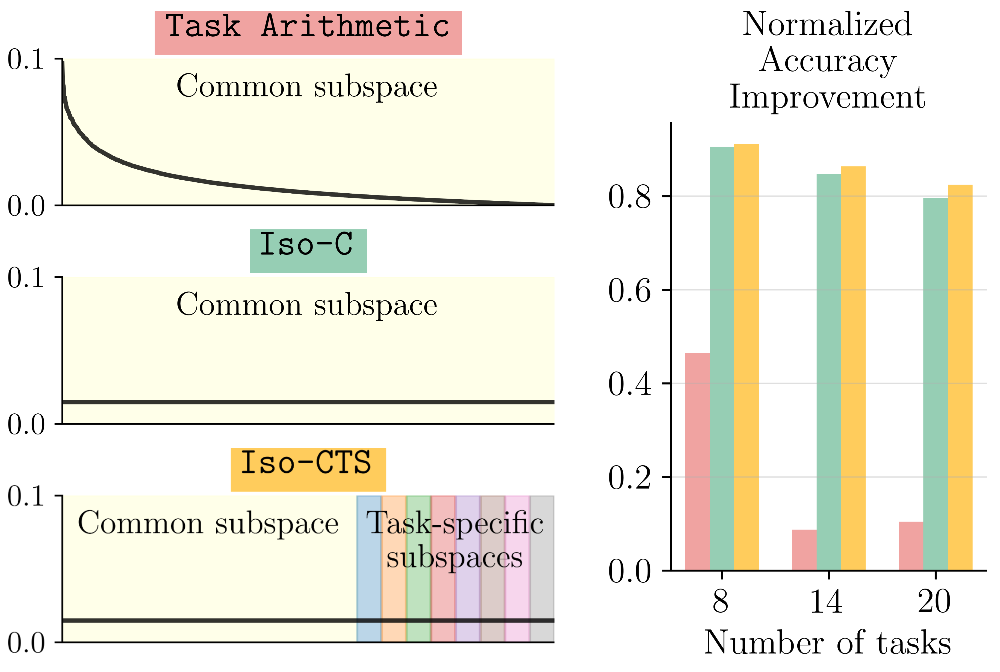

# No Task Left Behind: Isotropic Model Merging with Common and Task-Specific Subspaces
[](https://arxiv.org/abs/2502.04959)

<div align="left"></div>

> Spectrum of singular values for a single layer weight update matrix obtained by merging using Task Arithmetic (top) compared to our approaches: Iso-C (middle) and Iso-CTS (bottom). Task Arithmetic sums the task-specific matrices, which result in a spectrum with a few dominant components. Iso-C instead replaces this spectrum with a uniform one, which results in significant performance improvement. Iso-CTS enhances the common subspace with task-specific subspaces and yields state-of-the-art model merging performance.

### Set data and models locations
Modify `model_location` and `data_location` in `config/config.yaml` before evaluation. 

### Prepare the environment
```bash
conda env create
conda activate iso-merging
```


## 🔄 Merging methods
### `Iso-C`: Isotropic Merging in Common Subspace
tldr ✅: Merge by Task Arithmetic (summation) and make the spectrum of singular values uniform.
### `Iso-CTS`: Isotropic Merging in Common and Task-Specific Subspaces
tldr ✅: Merge by Task Arithmetic (common subspace), replace the least significant singular vectors by task-specific ones (task-specific subspaces) and and make the spectrum of singular values uniform.
### `Scale-SVD`: Low-Rank Plus Sparse Decomposition with Scaling
tldr ✅: Merge by Task Arithmetic and apply a low-rank plus sparse decomposition to each weight matrix, using input activations as scaling factors.


## 🧪 Merge and eval
```bash
model=ViT-B-16
num_tasks=8

# Collect layer statistics (needed for Iso-IASAD)
python main.py method="collect_stats" model=${model} num_tasks=${num_tasks}

# Merge and evaluate Iso-C
python main.py method="iso_c" model=${model} num_tasks=${num_tasks}

# Merge and evaluate Iso-CTS
python main.py method="iso_cts" model=${model} num_tasks=${num_tasks} method.common_space_fraction=0.8

# Merge and evaluate Scale-SVD
python main.py method="scale_svd" model=${model} num_tasks=${num_tasks} method.sparsity=0.1 method.rank_ratio=0.75
```

## 🧪 Test Scale-SVD
```bash
# Test the Scale-SVD function only
python scripts/test_scale_svd.py --function-test

# Test Scale-SVD with configuration
python scripts/test_scale_svd.py --config config/config.yaml

# Test layer statistics collection for ViT models
python scripts/test_scale_svd.py --layer-stats --config config/config.yaml
```

## 📊 Collect Layer Statistics
For optimal performance of Scale-SVD, you can collect layer-specific activation statistics:

```bash
# Collect statistics for a specific dataset
python main.py method="collect_stats" model="ViT-B-16" method.batch_size=32 method.num_batches=50
```